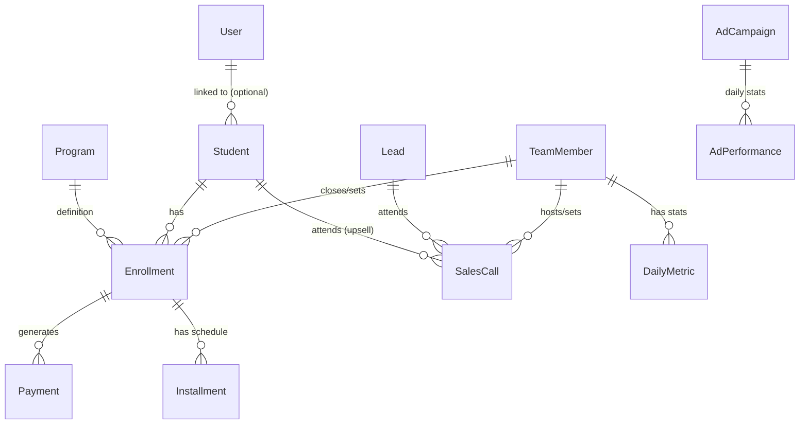

# Database Schema & Logic Guide

This document explains the data model powering the Info Product Portal. The database is built on **PostgreSQL** and managed using **Prisma ORM**.

## Core Logic Overview

The database is structured around the lifecycle of a customer:
1.  **Lead**: A potential customer enters the system (via Ads, Organic, etc.).
2.  **Sales Call**: A `TeamMember` (Setter/Closer) interacts with the Lead.
3.  **Student**: If the Lead buys, they become a Student.
4.  **Enrollment**: The Student is enrolled in a specific `Program`.
5.  **Payment**: The Enrollment generates financial records (Payments and Installments).

---

## Detailed Schema Breakdown

### 1. Authentication & Users (`users`)
This table manages access to the application itself.
*   **`User`**: People who can log in to the dashboard.
    *   `role`: Determines permission level (`ADMIN`, `SALES`, `MARKETING`).
    *   *Note: This is separate from `TeamMember`. A user logs in, but a TeamMember is tracked for sales performance.*

### 2. Team Performance (`team_members`, `daily_metrics`)
This section tracks the staff's performance stats.
*   **`TeamMember`**: A staff member tracked for KPIs.
    *   `role`: `CLOSER`, `SETTER`, or `DM_SETTER`.
    *   Can be linked to `Enrollment` (as closer/setter) and `SalesCall` (as host/setter).
*   **`DailyMetric`**: A snapshot of a team member's performance for a specific day.
    *   Tracks: `calls`, `conversations`, `booked`, `offers`, `closes`, `cash`.

### 3. CRM & Sales Flow (`leads`, `sales_calls`)
*   **`Lead`**: The entry point for potential customers.
    *   Tracks source (`source`, `campaign`, `medium`) for marketing attribution.
    *   `status`: `NEW`, `CONTACTED`, `QUALIFIED`, `LOST`.
*   **`SalesCall`**: Represents a meeting (Zoom/Phone) with a lead.
    *   Links a `Lead` (or `Student`) to a `TeamMember` (Host) and optionally a Setter.
    *   `outcome`: Records what happened (e.g., "Closed Won", "No Show").

### 4. Products & Enrollments (`students`, `programs`, `enrollments`)
This is the core of the business logic.
*   **`Program`**: The product being sold (e.g., "Coaching Program A").
*   **`Student`**: A customer profile.
    *   Can have multiple Enrollments (if they buy multiple programs).
*   **`Enrollment`**: The record of a Student buying a Program.
    *   **Crucial Link**: Connects `Student` + `Program`.
    *   `planType`: `PIF` (Paid in Full) or `SPLIT` (Payment Plan).
    *   `contractValue`: Total value of the sale.
    *   `closerId` / `setterId`: Links to `TeamMember` to credit the sale.

### 5. Finance (`payments`, `installments`)
Financial tracking is tied to the Enrollment.
*   **`Payment`**: A record of actual cash received.
    *   `status`: `PAID`, `PENDING`, `FAILED`, `REFUNDED`.
*   **`Installment`**: A scheduled future payment (for Split plans).
    *   `dueDate`: When the money is owed.
    *   `status`: `PENDING`, `PAID`, `OVERDUE`.
    *   *Logic*: When an Installment is paid, a corresponding `Payment` record is created/linked.

### 6. Marketing (`ad_campaigns`, `ad_performance`, `email_broadcasts`)
*   **`AdCampaign`**: High-level container for ads (Facebook, Google).
*   **`AdPerformance`**: Daily stats for a campaign.
    *   `spend`, `impressions`, `clicks`, `leads`, `revenue`.
    *   Used to calculate ROAS (Return on Ad Spend).
*   **`EmailBroadcast`**: Simple tracking of sent newsletters.

---

## Entity Relationship Diagram (ERD) Conceptual

